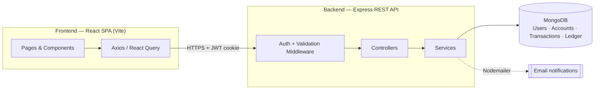
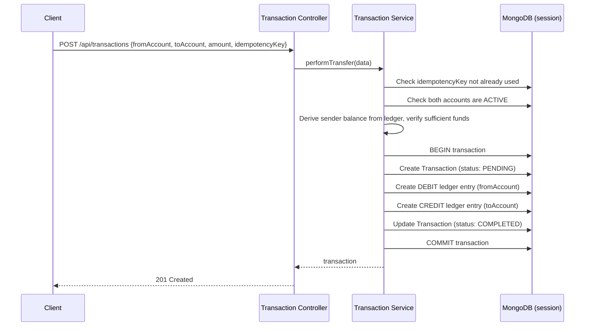

# LedgerCore

**A full-stack banking ledger system built on real double-entry accounting principles — every account balance is derived, never stored, from an immutable ledger of debits and credits.**


---

## Table of Contents

- [Overview](#overview)
- [Key Features](#key-features)
- [Tech Stack](#tech-stack)
- [Architecture & System Design](#architecture--system-design)
- [Getting Started](#getting-started)
- [API Documentation](#api-documentation)
- [Testing](#testing)
- [Roadmap](#roadmap)
- [Contributing](#contributing)
- [License & Acknowledgments](#license--acknowledgments)

---

## Overview

LedgerCore is a MERN-stack banking application that models money movement the way real financial systems do: as a **double-entry ledger**. Instead of storing a `balance` field on an account and mutating it on every transfer, every transaction writes exactly one `DEBIT` entry and one `CREDIT` entry to an append-only ledger collection, wrapped in a single MongoDB transaction. An account's balance is always *computed* on demand by summing its ledger entries — which makes the system auditable, consistent, and resistant to the kind of drift that plagues naive "update a number" balance models.

On top of that ledger engine sits a JWT-authenticated REST API and a React dashboard for managing accounts, transferring funds, and visualizing spending.

- **Backend**: `/backend` — Express 5 REST API, MongoDB via Mongoose, JWT auth, Zod validation
- **Frontend**: `/frontend` — React 19 + Vite SPA, Tailwind CSS v4, React Query, Recharts

---

## Key Features

**Core banking engine**
- 🔒 Double-entry ledger — every transfer produces a matching debit and credit, committed atomically via a MongoDB session
- 🧮 Derived balances — account balance is aggregated from ledger history, never stored/mutated directly
- 🔁 Idempotent transfers — each transaction requires a unique `idempotencyKey`, preventing duplicate transfers on retry
- 🏦 Multi-account support per user, with account status (`ACTIVE` / `FROZEN` / `CLOSED`)
- 📜 Immutable ledger entries — the schema itself blocks update/delete operations on ledger records at the database layer

**Application features**
- 🔐 JWT authentication (httpOnly cookie, with `Authorization: Bearer` header fallback) and a token-blacklist collection for real logout invalidation
- 👤 Profile management (edit name/email, change password)
- 💸 Fund transfers between accounts, with a downloadable PDF receipt per transaction
- 📊 Analytics dashboard — monthly cash flow, income vs. expense breakdown, category-wise spending
- ⚙️ User preferences (theme, currency, notification settings)
- 🧪 One-click **demo login** that seeds a temporary demo user with realistic sample data — no signup required
- 📧 Transactional emails (registration, transfer notifications) via Nodemailer
- 📱 Responsive, modern UI with light theme, collapsible mobile navigation, and accessible modals (Esc/backdrop-to-close)

---

## Tech Stack

### Backend
| Layer | Technology |
|---|---|
| Runtime | Node.js |
| Framework | Express 5 |
| Database | MongoDB + Mongoose (with multi-document ACID transactions) |
| Auth | JSON Web Tokens (`jsonwebtoken`) + `bcryptjs` password hashing |
| Validation | Zod schemas via a reusable `validateRequest` middleware |
| Email | Nodemailer |
| Config | dotenv |

### Frontend
| Layer | Technology |
|---|---|
| Framework | React 19 |
| Build tool | Vite 8 |
| Styling | Tailwind CSS v4 |
| Routing | React Router 7 |
| Forms & validation | React Hook Form + Zod |
| Data fetching | Axios, TanStack React Query |
| Charts | Recharts |
| Animation | Framer Motion |
| Icons | lucide-react |
| Notifications | Sonner (toasts) |
| PDF export | jsPDF + html2canvas |

---

## Architecture & System Design

### High-level architecture



The backend follows a layered structure: **routes → middleware (auth / validation) → controllers → services → models**. Controllers stay thin — they parse the request and call a service; services own the actual business logic (e.g. `transaction.service.js` owns the entire transfer flow), which keeps the ledger rules testable independent of Express.

### The double-entry transfer flow

Every fund transfer runs through `transactionService.performTransfer()`, which executes as a single MongoDB session:



If any step fails, the whole session is aborted and rolled back — the ledger can never end up with a debit that isn't matched by a credit.

### Data model

```
User ──< Account ──< Ledger >── Transaction
```

| Model | Purpose | Notable fields |
|---|---|---|
| `User` | Auth identity | `email`, `password` (hashed, `select:false`), `systemUser`, `demo` |
| `Account` | A wallet owned by a user | `type` (`SAVINGS`/`CURRENT`/`CREDIT`/`CASH`), `status`, `currency`; `getBalance()` aggregates from `Ledger` |
| `Transaction` | A single money-movement event | `fromAccount`, `toAccount`, `amount`, `transactionType`, `status`, unique `idempotencyKey` |
| `Ledger` | Immutable double-entry record | `account`, `transaction`, `type` (`CREDIT`/`DEBIT`), `amount` — update/delete hooks throw by design |
| `Settings` | Per-user preferences | `theme`, `currency`, notification flags |
| `TokenBlacklist` | Revoked JWTs (logout) | `token` |

### Project structure

```
LedgerCore/
├── backend/
│   ├── server.js                 # Entry point (connects DB, starts Express)
│   └── src/
│       ├── app.js                # Express app, CORS, route mounting
│       ├── config/                # DB connection, enum constants
│       ├── controllers/           # Thin request handlers
│       ├── services/              # Business logic (ledger, analytics, dashboard, email...)
│       ├── models/                # Mongoose schemas
│       ├── middlewares/           # auth, validateRequest, error handler
│       ├── validations/           # Zod schemas
│       └── utils/                 # AppError, sendResponse, asyncHandler, etc.
│   └── scripts/seed.js           # Populates dev DB with demo users & 100 sample transactions
│
└── frontend/
    └── src/
        ├── pages/                 # Route-level screens (dashboard, accounts, transactions, analytics, profile, settings, auth)
        ├── components/            # ui/, layout/, dashboard/, accounts/, transactions/, analytics/, settings/, forms/
        ├── layouts/                # DashboardLayout, AuthLayout
        ├── context/                # AuthContext / AuthProvider
        ├── services/                # Axios API clients per domain
        ├── validations/            # Zod schemas (client-side)
        └── utils/                   # formatCurrency, PDF receipt generator
```

---

## Getting Started

### Prerequisites

- **Node.js** v18 or later, npm
- **MongoDB** — a local instance, or a free [MongoDB Atlas](https://www.mongodb.com/atlas) cluster

### 1. Clone and install

```bash
git clone https://github.com/Aditya1v/LedgerCore.git
cd LedgerCore

# Backend
cd backend
npm install

# Frontend (in a second terminal)
cd ../frontend
npm install
```

### 2. Configure environment variables

Create a `.env` file inside `backend/`:

```env
MONGO_URI=mongodb://localhost:27017/ledgercore
JWT_SECRET=replace-with-a-long-random-string

# Optional — only required for outgoing email notifications
CLIENT_ID=your-google-oauth-client-id
CLIENT_SECRET=your-google-oauth-client-secret
REFRESH_TOKEN=your-google-refresh-token
EMAIL_USER=your-email@gmail.com
```

> The frontend needs no `.env` — it's pre-configured to call `http://localhost:3000/api`, and the backend's CORS policy already allows `http://localhost:5173` and `:5174`.

### 3. Run it

```bash
# Terminal 1 — backend (http://localhost:3000)
cd backend
npm run dev

# Terminal 2 — frontend (http://localhost:5173)
cd frontend
npm run dev
```

### 4. (Optional) Seed sample data

To explore the app with realistic data instead of starting from an empty account:

```bash
cd backend
npm run seed
```

This creates a system account plus three test users, each with multiple accounts and ~100 randomized transactions across categories like Food, Shopping, Travel, and Bills.

| Email | Password |
|---|---|
| `aditya@test.com` | `Password@123` |
| `rahul@test.com` | `Password@123` |
| `aman@test.com` | `Password@123` |

Alternatively, click **Try Demo** on the login screen at any time — it spins up (or reuses) a temporary demo account with seeded data on the fly, no manual setup required.

### 5. Build for production

```bash
cd frontend
npm run build      # outputs to frontend/dist
```

```bash
cd backend
npm start           # node server.js
```

---

## API Documentation

All endpoints are prefixed with `/api`. Protected routes require a valid JWT, sent either as an httpOnly `token` cookie (set automatically on login/register) or an `Authorization: Bearer <token>` header.

**Standard response envelope**

```jsonc
// Success
{ "success": true, "message": "…", "data": { /* … */ } }

// Error
{ "success": false, "status": "fail" | "error", "message": "…" }
```

### Auth — `/api/auth`

| Method | Endpoint | Auth | Body | Description |
|---|---|---|---|---|
| POST | `/register` | Public | `{ name, email, password }` | Create a user, set auth cookie, send welcome email |
| POST | `/login` | Public | `{ email, password }` | Authenticate and set auth cookie |
| POST | `/logout` | Protected | — | Blacklist the current token |
| GET | `/me` | Protected | — | Return the current authenticated user |
| PUT | `/profile` | Protected | `{ name, email }` | Update name/email |
| PUT | `/change-password` | Protected | `{ currentPassword, newPassword }` | Change password |

### Demo — `/api/demo`

| Method | Endpoint | Auth | Description |
|---|---|---|---|
| POST | `/` | Public | Get-or-create a demo user, seed sample data, and log them in |

### Accounts — `/api/accounts`

| Method | Endpoint | Auth | Body | Description |
|---|---|---|---|---|
| POST | `/` | Protected | `{ name, type }` — `type`: `SAVINGS`\|`CURRENT`\|`CREDIT`\|`CASH` | Create an account |
| GET | `/` | Protected | — | List the user's accounts, each with a live derived balance |
| GET | `/balance/:accountId` | Protected | — | Get a single account's derived balance |

### Transactions — `/api/transactions`

| Method | Endpoint | Auth | Body / Query | Description |
|---|---|---|---|---|
| GET | `/` | Protected | Query: `page, limit, search, category, direction (IN/OUT), sort (latest/oldest/amount_asc/amount_desc)` | Paginated, filterable transaction history |
| GET | `/:id` | Protected | — | Full transaction detail, including its ledger entries |
| POST | `/` | Protected | `{ fromAccount, toAccount, amount, category, merchant?, description?, tags?, idempotencyKey }` | Execute a transfer (double-entry, atomic) |
| POST | `/system/initial-funds` | System user only | `{ toAccount, amount, idempotencyKey }` | Fund an account from the system account (used to seed a new account's opening balance) |

### Dashboard — `/api/dashboard`

| Method | Endpoint | Auth | Description |
|---|---|---|---|
| GET | `/summary` | Protected | Total balance, total income/expense, account count, recent transactions |

### Analytics — `/api/analytics`

| Method | Endpoint | Auth | Description |
|---|---|---|---|
| GET | `/` | Protected | Monthly cash flow, category-wise spending, transaction count, average/largest transaction stats |

### Settings — `/api/settings`

| Method | Endpoint | Auth | Body | Description |
|---|---|---|---|---|
| GET | `/` | Protected | — | Get current user preferences |
| PUT | `/` | Protected | `{ theme?, currency?, emailNotifications?, transactionAlerts?, marketingEmails? }` | Update preferences |

### Example: transferring funds

```bash
curl -X POST http://localhost:3000/api/transactions \
  -H "Authorization: Bearer YOUR_JWT" \
  -H "Content-Type: application/json" \
  -d '{
    "fromAccount": "665f1c2e...",
    "toAccount": "665f1c9a...",
    "amount": 1500,
    "category": "Transfer",
    "idempotencyKey": "b3f6c1a0-6e2a-4b0e-9c1a-6f2a0b3c1a02"
  }'
```

---

## Testing

There is currently **no automated test suite** in this repository — the backend's `npm test` script is a placeholder, and neither package has a test runner installed yet. In the meantime, the recommended way to verify changes is:

- **Manual API testing** — use `curl` or import the endpoints above into Postman/Insomnia. Registering a user, logging in, creating an account, and posting a transfer exercises the full ledger flow end-to-end.
- **Seeded data** — `npm run seed` (backend) gives you multiple users, accounts, and 100 transactions to click through in the UI without manually creating everything.
- **Linting** — the frontend has ESLint configured:
  ```bash
  cd frontend
  npm run lint
  ```
---


## License & Acknowledgments

### License

Licensed under the **MIT License** — see [`LICENSE`](./LICENSE) for the full text. You're free to use, modify, and distribute this project, including commercially, with attribution.

### Acknowledgments
- Built and maintained by **Aditya Verma**
